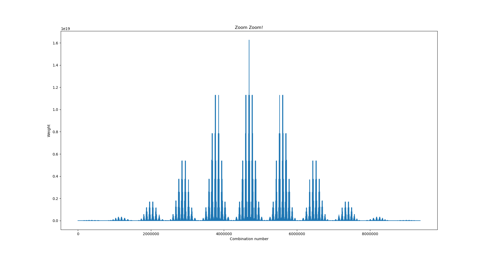

# mset
multiset combinatorics

Please read the output of each of the modules, it is also a good idea
to have the code open in an editor as well as the libraries (at least
core.py) in order to follow the processflow.

There are a few working modules in the mset_mod/ directory, please run
the modules once you have placed yourself in that directory.

In order to run them (for example functionWalkThrough.py), simply do a:

 $ python functionWalkThrough.py

And read carefully the output, change the code if you want (M and k)
so you can understand it better.

The suggested order for testing the modules is:

1) functionWalkThrough.py \# the essential
2) bucketKtuple.py \# reframing the problem
3) itercomp.py \# comparison with itertools
4) count_comp.py \# Diverse optimisations give same results
5) memoTests.py \# Speed boost by memoization BIG numbers
6) countBenchmarcks.py \# Including C2
7) symmetry.py \# just testing C1 symmetry
8) vBench.py \# Just memoizing the V function and see a speed boost
9) bucketList.py \# Needs matplotlib, also it may take a while to run
		 \# integer numbers are humongous, Gauss Gauss Gauss...
10) symmetryBenchC3.py \# Not worthy

Note that bucketList.py generates a matplotlib window with the
following plot:

